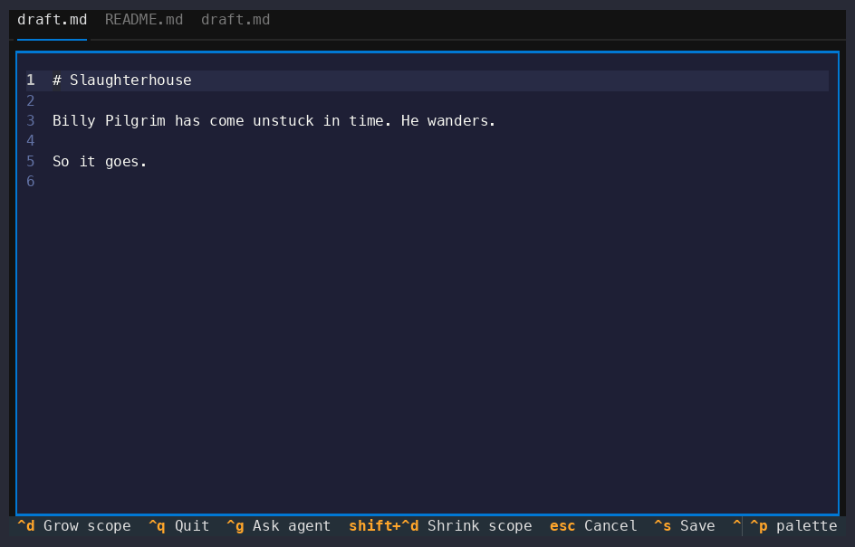

# vonnegut

Full-screen terminal prose editor with a scope-laddering AI agent. The whole
screen is your markdown. Grow a scope around the cursor, then have the agent
rewrite exactly that span — its revision streams in place.



## Run

```sh
export OPENAI_API_KEY=sk-...
uv run vonnegut               # edits ./draft.md
uv run vonnegut notes.md      # edits ./notes.md
uv run vonnegut -d ~/writing chapter1.md
uv run vonnegut -t dracula draft.md
```

## Keys

- `Ctrl+D` — grow the edit scope one rung, anchored at the cursor:
  **word → sentence → paragraph → section → document** (clamps at document).
  The span highlights and the cursor locks while a scope is active.
- `Ctrl+Shift+D` — shrink the scope one rung; back past word unlocks the cursor.
- `Ctrl+G` — open the instruction box for the current scope (or the whole
  document if none is active). Type a request, `Enter`. The box closes and the
  agent's revision streams directly into that range, highlighted as it lands.
  When it finishes, the scope collapses back to the cursor.
- `Esc` — cancel: close the box and collapse to the cursor.
- `Ctrl+S` save · `Ctrl+T` cycle theme · `Ctrl+Q` quit.
- Tabs (top) — one per `.md` file in the working directory; click to switch
  (auto-saves the current file).

## Agent

The app owns the range (word/sentence/paragraph/section detection); the agent
returns only replacement text, which is streamed into that exact span. Model
override: `VONNEGUT_MODEL=openai:gpt-4o-mini`. Theme: `VONNEGUT_THEME=dracula`.

Note: some terminals don't distinguish `Ctrl+Shift+D` from `Ctrl+D`. If shrink
doesn't register, that's your terminal — tell me and I'll add an alternate key.
